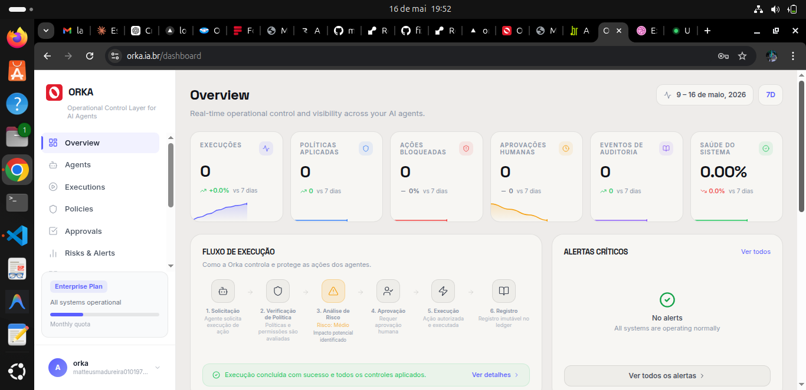
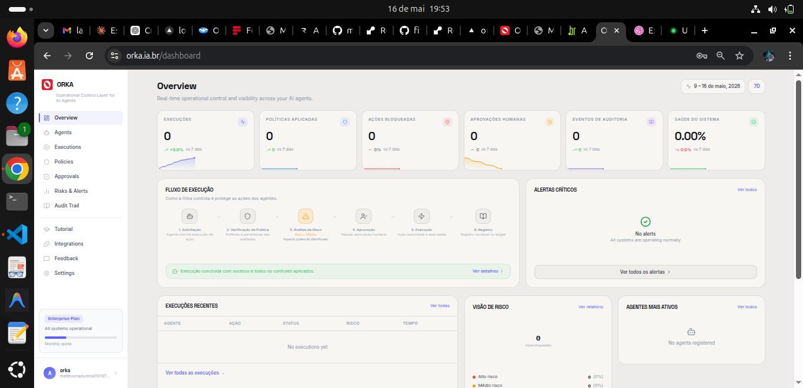

<p align="center">
  
</p>

# ORKA

**Stop your AI agents from burning money on runaway loops — and prove what you saved.**

AI agents loop on failed calls and burn tokens, spend money without asking, delete data, and hit APIs with no checkpoint. Orka sits in front of every action: it cuts the runaway loop, caps the spend, blocks the dangerous call, holds risky actions for human approval, and logs everything to a tamper-evident ledger.

[](https://pypi.org/project/orkaia/) [](https://github.com/mathhMadureira/orka/blob/main/LICENSE) [](#)

[**orka.ia.br →**](https://orka.ia.br)

---

## Why this exists

Real incidents, not hypotheticals:

- Teams report agents looping on a failed call and burning hundreds of dollars in tokens over a weekend — with no alert.
- An OpenAI Operator agent spent $31 on eggs without asking — its own safety check never fired.
- Replit's coding agent deleted a production database in 9 seconds, during a freeze meant to prevent exactly that.
- Air Canada was held legally liable for a refund policy its chatbot invented on the spot.

Most teams have **no checkpoint** between the agent's decision and the expensive — or irreversible — action.

---

## What Orka does

| Capability | What it does |
|---|---|
| **Loop guard** | Detects an agent repeating the same failed action and cuts it before it drains the budget |
| **Spend cap** | Hard token/cost limit per run — stops the execution when crossed |
| **Savings ledger** | Quantifies, in dollars, the waste it prevented — "Orka saved you $X" |
| **Human approval** | Holds high-risk actions for human sign-off before they execute |
| **Immutable audit trail** | SHA-256 chained ledger — tamper-evident record of every action and decision |
| **Policy engine** | Blocks actions by rule: task type, domain, quota, risk level |
| **Multi-protocol** | MCP, A2A, REST, and custom agent protocols |

---

## Quickstart

```bash
pip install orkaia
```

```python
import orka

orka.init(api_key="orka_...")  # get a key at orka.ia.br

@orka.guard(agent_id="my-agent", task_type="web_search")
def search(query: str) -> str:
    return your_llm.call(query)

# Every call: policy check → risk score → [human approval?] → execute → ledger entry
result = search("latest quarterly report")
```

Every execution appears in real time at [orka.ia.br/dashboard](https://orka.ia.br/dashboard): input/output, duration, cost, status, risk score, and a searchable audit trail.

---

## How it works

```
Agent  →  Orka  →  Loop guard  →  Spend cap  →  Policy check  →  Risk score  →  [Human approval?]  →  Execute  →  Ledger
```

The SDK intercepts the call and hands it to the Orka backend. The decision logic (loop detection, budget enforcement, policy evaluation, risk scoring) runs server-side. The ledger is immutable and cryptographically chained.

---

## Economy features (new)

The reason most teams lose money on agents isn't a single catastrophic event — it's the slow bleed of retry loops, redundant calls, and uncapped sessions.

Orka's economy layer tracks cost per action, detects loops automatically, enforces budget caps, and generates a savings report showing exactly how much it prevented.

```python
# Economy is built into the guard — no extra code
@orka.guard(agent_id="analyst", task_type="data_fetch", risk="LIMITED")
def fetch_data(source: str) -> dict:
    return api.get(source)

# If the agent loops on the same call 3+ times, Orka cuts it.
# If the run exceeds the cost cap, Orka stops it.
# The dashboard shows: "$X saved this week by preventing Y interventions."
```

---

## Open-core model

| Layer | What it is | License |
|---|---|---|
| **SDKs** (`python/`, `typescript/`) | `@guard` decorator, REST client, integrations | MIT, this repo |
| **Backend** | Policy engine, risk scoring, ledger, approval routing | Managed service at orka.ia.br |

The SDKs are open source — read them, fork them, audit them. The backend runs the decision logic. A fully local/offline mode is on the roadmap.

---

## Integrations

Works with any framework. Add one decorator or callback:

- **LangChain**: `OrkaCallbackHandler` — every LLM call and chain step logged automatically
- **CrewAI / AutoGen**: wrap any tool with `@orka.guard`
- **OpenAI**: `OrkaOpenAIAdapter` for function-calling loops
- **MCP**: native MCP support — Orka as a tool server for Claude, Cursor, Windsurf

See [`python/examples/`](python/examples/) and [`python/orka/integrations/`](python/orka/integrations/) for ready-to-run code.

---

## API reference

Base URL: `https://orka.ia.br/api/v1`

| Endpoint | Method | What it does |
|---|---|---|
| `/agents/` | GET / POST | List or register agents |
| `/handover` | POST | Submit an action for Orka to process |
| `/handover/{task_id}` | GET | Check execution status |
| `/xshield/policies` | GET / POST | Manage governance policies |
| `/approvals` | GET | List pending human approvals |
| `/approvals/{id}/approve` | POST | Approve a pending action |
| `/xledger/entries` | GET | Query the immutable audit ledger |
| `/xledger/verify` | GET | Verify chain integrity |
| `/assurance/risk-report` | GET | Per-agent risk scores |
| `/metrics/dashboard` | GET | Real-time platform metrics |

Auth: `X-API-Key` header.

---

## Dashboard




---

## Contributing

Issues and PRs welcome on the SDKs. The governance backend is closed-source — if you want to discuss architecture, integrations, or the roadmap, open a discussion or reach out.

---

<p align="center">
Built for teams that deploy AI agents and need to stay in control.
<br>
<strong><a href="https://orka.ia.br">orka.ia.br</a></strong> · contato@orka.ia.br
</p>
